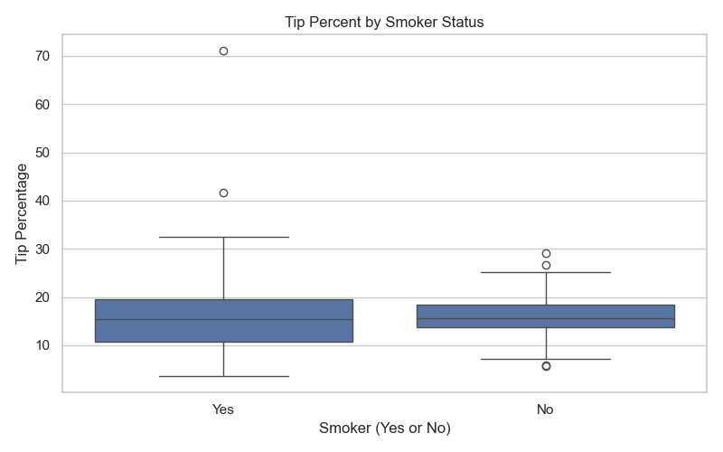

# datafun-06-eda

## Project Purpose
This project explores basic Exploratory Data Analysis (EDA) using Jupyter notebooks and common Python libraries.

## Virtual Environment Setup
```bash
python -m venv .venv
.venv\Scripts\Activate.ps1
python -m pip install --upgrade pip setuptools wheel
python -m pip install jupyterlab numpy pandas pyarrow matplotlib seaborn
pip freeze > requirements.txt
## Project Results

We performed exploratory data analysis (EDA) on the `tips` dataset using pandas, matplotlib, and seaborn.

### Key Findings

- The average tip percentage was calculated and grouped by smoking status.
- Results were saved as CSV and Excel files in the `results/` folder.
- A box plot was created to compare `tip_percent` by smoker status.

### Saved Outputs

- `results/avg_tip_percent_by_smoker.csv`
- `results/avg_tip_by_day.xlsx`
- `results/tip_percent_by_smoker_box.png`

### Visual Example


